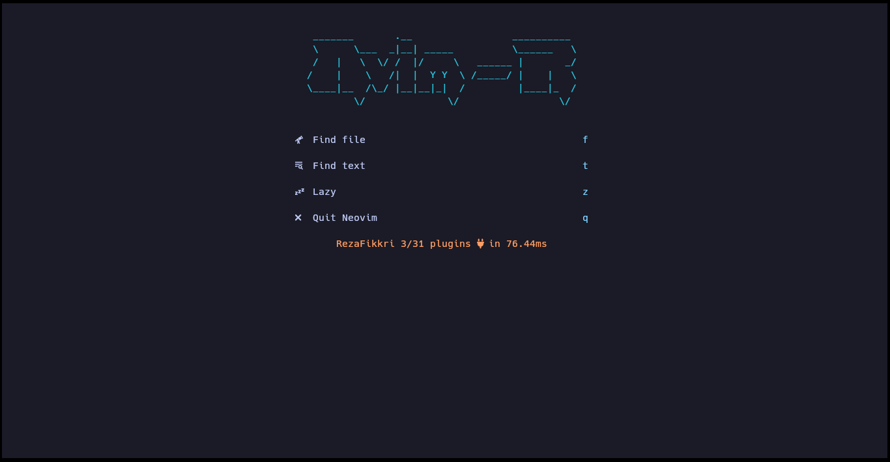
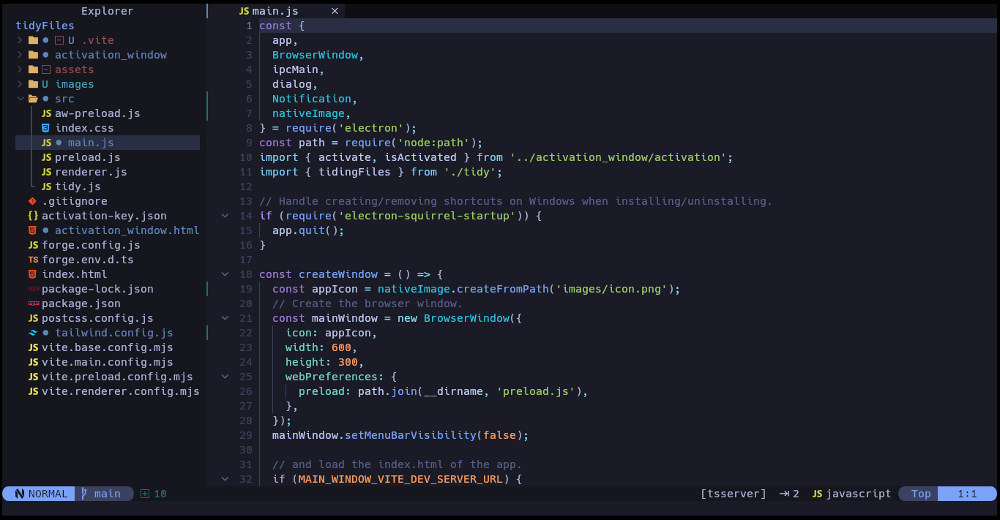

<h1 align="center">Nvim R</h1>

<div align="center">
  
  
  <a href="https://github.com/rezafikkri/Nvim-R">
    
  </a>
</div>




## Requirements
1. Neovim >= [v0.10.0](https://github.com/neovim/neovim/releases/latest)
2. [Nerd font](https://www.nerdfonts.com/)
3. C compiler for `nvim-treesitter`. See [here](https://github.com/nvim-treesitter/nvim-treesitter#requirements)

## Install
- Remove old config or make backup
```bash
# remove old
rm -rf ~/.config/nvim
rm -rf ~/.local/share/nvim

# make backup
mv ~/.config/nvim ~/.config/nvim.bak
mv ~/.local/share/nvim ~/.local/share/nvim.bak
```
- Clone nvim-r
```bash
git clone https://github.com/rezafikkri/Nvim-R.git ~/.config/nvim
```
- Remove `.git` folder
```bash
rm -rf ~/.config/nvim/.git
```
- Start neovim
```bash
nvim
```

## Keymaps
Info:
- `<leader>` is space
- `<C>` is Ctrl, so if `<C-a>` then `Ctrl+a`
- `<S>` is Shift, so if `<S-a>` then `Shift+a`
- `<A>` is Alt, so if `<A-a>` then `Alt+a`

### Window
<table>
  <tr>
    <th>Key</th>
    <th>Description</th>
    <th>Mode</th>
  </tr>
  <tr>
    <td><code>&lt;C-h&gt</code></td>
    <td>Move the cursor to left window</td>
    <td>Normal</td>
  </tr>
  <tr>
    <td><code>&lt;C-j&gt</code></td>
    <td>Move the cursor to bottom window</td>
    <td>Normal</td>
  </tr>
  <tr>
    <td><code>&lt;C-k&gt</code></td>
    <td>Move the cursor to top window</td>
    <td>Normal</td>
  </tr>
  <tr>
    <td><code>&lt;C-l&gt</code></td>
    <td>Move the cursor to right window</td>
    <td>Normal</td>
  </tr>

  <tr>
    <td><code>&lt;C-Up&gt</code></td>
    <td>Decrease window size (horizontal)</td>
    <td>Normal</td>
  </tr>
  <tr>
    <td><code>&lt;C-Down&gt</code></td>
    <td>Increase window size (horizontal)</td>
    <td>Normal</td>
  </tr>
  <tr>
    <td><code>&lt;C-Left&gt</code></td>
    <td>Descrease window size (vertical)</td>
    <td>Normal</td>
  </tr>
  <tr>
    <td><code>&lt;C-Right&gt</code></td>
    <td>Increase window size (vertical)</td>
    <td>Normal</td>
  </tr>
</table>

### Terminal
<table>
  <tr>
    <th>Key</th>
    <th>Description</th>
    <th>Mode</th>
  </tr>
  <tr>
    <td><code>&lt;C-\&gt</code></td>
    <td>Toggle (last) float terminal</td>
    <td>Normal, Terminal</td>
  </tr>
</table>

Tip:
- Open multiple terminal: `[num] <C-\>` (in normal mode), ex. `1 <C-\>` for open first terminal, `2 <C-\>` for open second terminal, etc.
- If you has open second terminal and want to back first terminal, simple, press `1 <C-\>` again (in normal mode).

### Editing
<table>
  <tr>
    <th>Key</th>
    <th>Description</th>
    <th>Mode</th>
  </tr>
  <tr>
    <td><code>&lt;A-j&gt</code></td>
    <td>Move text to down</td>
    <td>Normal, Visual</td>
  </tr>
  
  <tr>
    <td><code>&lt;A-k&gt</code></td>
    <td>Move text to up</td>
    <td>Normal, Visual</td>
  </tr>
</table>
